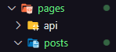

# Ignews

## Back-end no Front-end
### WebHooks do Stripe
  O que são WebHooks? WebHooks são patterns muito utilizado para integração entre sistemas na web.

Eles ajudam a avisar a aplicação sobre algo na aplicação terceira.

Como por exemplo:
  > - O Stripe não consegue receber o pagamento pois a forma de pagamento está sem fundo, ou sem limite.
  > - O Stripe deve usar um WebHook para avisar a nossa aplicação de que o usuário específico não pode continuar com a sua subscrição, então a aplicação deve fazer algo com essa informação

O Stripe por padrão tem como configurar seus Webhooks.


Como estamos em um ambiente de produção, seguimos com a descrição do stribe na área de teste em ambiente local. Caso a aplicação já esteja em produção, podemos adicionar um endpoint que nos dá acesso ao cadastro do link da nossa aplicação em produção.

O link para acesso da configuração do webhook do stripe de teste em ambiente local está neste [link](https://dashboard.stripe.com/test/webhooks/create?endpoint_location=local)

Dependendo do sistemas operacional, seguimos com a instalação do CLI do stripe para reconhecimento dos webhooks

Após a configuração da variável de ambiente _stripe_ vamos para as instruções descritas no stripe.

- Acessamos nosso login do stripe com o comando ```stripe login```

  

- Em seguida entraremos com o comando ```stripe listen --forward-to localhost:1231/webhooks``` com o final o caminho da nossa aplicação que receberá os webhooks do stripe

- Criamos o arquivo que receberá os webhooks, 
```typescript
import { NextApiRequest, NextApiRequest } from "next"

export default (req: NextApiRequest, res: NextApiResponse) => {
  console.log('evento recebido')

  return res.status(200).json({ ok: true })
}
```

Deixando o prompt do stripe executando teremos diversas novas requisições vindas do stripe.


### Ouvindo eventos do Stripe

Para ouvir os eventos do stripe pouco a pouco, importamos o Readable da lib stream, ele nos ajuda a ler as requisições pouco a pouco, pedaço por pedaço de uma stream. Para isso funcionar usamos um código pronto:

```typescript
import { Readable } from "stream"

async function buffer(readable: Readable) {
  const chunks = [];

  for await (const chunk of readable) {
    chunks.push(
      typeof chunk === "string" ? Buffer.from(chunk) : chunk
    )
  }
  
  return Buffer.concat(chunks);
}
```

Utilizando a função acima na nossa default function, poderemos acessar os webhooks a partir da requisção recebida.

Para que as requisições sejam legíveis para o next, na sua própria documentação, temos opções de configurar a maneira como ele lê as requisições, pois por padrão o Next faz a leitura de requisições como formulários json. Dessa forma, utilizaremos o _custom config_ para modificar a leitura padrão do Next para fazer a leitura de uma Stream.

```typescript
export const config = {
  api: {
    bodyParser: false
  }
}

const handlerWebhook = async (req: NextApiRequest, res: NextApiResponse) => {
  const buf = await buffer(req);

  res.json({ received: true }) 
}

export default handlerWebhook;

```

Os webhooks quando criados por terceiros, enviam um código próprio para enviar os eventos de maneira mais segura, porque assim como as outras rotas, o recebimento dos eventos são feitos por uma rota e qualquer um com conhecimento sobre ela poderia fazer esse acesso.

Com o webhook criado então, ele envia uma chave de acesso dentro do terminal visto anteriormente e ele será nossa chave de acesso como uma variável local de ambiente.

Para facilitar a identificação de eventos úteis para nossa aplicação, implementamos um conjunto com somente os eventos que desejamos na aplicação que provem do Stripe. A partir disso, "filtramos" os eventos das requisições com somente aqueles que desejamos.

```typescript
const relevantEvents = new Set([
  'checkout.session.completed'
])

const handlerWebhook = async (req: NextApiRequest, res: NextApiResponse) => {
  if (req.method === 'POST'){
    const buf = await buffer(req);
    const secret = req.headers['stripe-signature']

    let event: Stripe.Event;

    try {
      event = stripe.webhooks.constructEvent(buf, secret, process.env.STRIPE_WEBHOOK_SECRET)
    } catch (err){
      return res.status(400).send(`Webhook error: ${err}`)
    }

    const { type } = event;

    if (relevantEvents.has(type)) {
      console.log('evento recebido', event)
    }

    res.json({ received: true })
  } else {
    res.setHeader("Allow", 'POST');
    res.status(405).end('Method Not Allowed');
  }

}
```

Nessa implementação, eu consigo verificar se o método da requisição é POST. Consigo verificar o evento da forma como é descrito na documentação do Stripe e condicionar para verificar se o evento desejado está na requisição recebida e assim enviar a confirmação com "Evento recebido" e a descrição do evento.

Caso dê errado, é enviado um status de erro.

### Salvando dados do evento

Para designar determinadas funções para cadaa tipo de evento desejado pela nossa aplicação, como por exemplo, inscrição de um usuário, pagamento não efetuado, cancelamento de assinatura, entre outros eventos, modificamos o condicional de verificação de que os determinados eventos estão presentes no webhook e colocamos uma estrutura _switch(type)_ para levar os eventos a suas determinadas funções.

```typescript
const handlerWebhook = async (req: NextApiRequest, res: NextApiResponse) => {
  if (req.method === 'POST'){
    const buf = await buffer(req);
    const secret = req.headers['stripe-signature']

    let event: Stripe.Event;

    try {
      event = stripe.webhooks.constructEvent(buf, secret!, process.env.STRIPE_WEBHOOK_SECRET!)
    } catch (err){
      return res.status(400).send(`Webhook error: ${err}`)
    }

    const { type } = event;

    if (relevantEvents.has(type)) {
      try {
        switch(type) {
          case 'checkout.session.completed':
            const checkoutSession = event.data.object as Stripe.Checkout.Session
            await saveSubsccription(
              checkoutSession.subscription?.toString(),
              checkoutSession.customer?.toString()
            )
            break;
          default:
            throw new Error('Unhandled event.')
        }
      } catch (err) {
        return res.json({ error: 'Webhook handler failed.'})
      }

    }

    res.json({ received: true })
  } else {
    res.setHeader("Allow", 'POST');
    res.status(405).end('Method Not Allowed');
  }

}
```

No caso do evento exemplo feito acima, verificamos quando um usuário efetua a sua inscrição na newsletter Ignews. A partir disso é feito um chamado para uma função criada em uma outra pasta dentro da pasta api ficando desta forma:

```
../api/_lib/manageSubscription.ts
```

Foi colocado o underline "_" antes do nome da pasta para não ser tratada como uma rota da aplicação. A aplicação em si ignora essa pasta por não designar uma rota dela podendo ser colocada tanto dentro da pasta api como na pasta pages, ela não é reconhecida.

Logo, dentro deste arquivo temos o seguinte código:

```typescript
import { query as q } from "faunadb"
import { fauna } from "../../../services/fauna"
import { stripe } from "@/src/services/stripe"

export async function saveSubsccription(
  subscriptionId: string,
  customerId: string,
) {
  // Buscar usuário no Fauna com o customerId
  const userRef = await fauna.query(
    q.Select( // Selecionar um campo específico do retorno da query (no caso, o ref)
      "ref",
      q.Get(
        q.Match(
          q.Index("user_by_stripe_customer_id"),
          customerId
        )
      )
    )
  )

  // Salvar os dados da subscription do usuário no FaunaDB
  const subscription = await stripe.subscriptions.retrieve(subscriptionId);

  const subscriptionData = {
    id: subscription.id,
    userId: userRef,
    status: subscription.status,
    price_id: subscription.items.data[0].price.id,
  }

  await fauna.query(
    q.Create(
      q.Collection('subscriptions'),
      { data: subscriptionData }
    )  
  )
}
```

Cabe citar que o código descrito acima, só funcionará após a criação de uma nova collection para guardar novos dados da nossa aplicação, as inscrições. Deverão ser criadas a collection ___subscriptions___ e um novo indexador na collection ___users___ com o nome de _user_by_stripe_customer_id_

Agora ao código:
- Primeiro iremos buscar o usuário cadastrado no Fauna que fez a incrição e selecionar a sua referência que posteriormente utilizaremos para guardar como dado da inscrição.

- Em seguida, buscamos o dado da subscrição do usuário no stripe.

- Em fim, utilizamos o objeto "subscriptionData" para formatar os dados da subscrição e assim salvar esse objeto dentro do banco do Fauna na collection subscriptions.

<h2 style="color: #2470df">
  Ouvindo mais eventos
</h2>

Para adentrar ainda mais no eventos que os webhooks do Stripe nos fornecem, vamos para outras opções de eventos que podemos colocar que poderão ser úteis para nossa aplicação além do _checkout.session.completed_ que vimos anteriormente

```typescript
const relevantEvents = new Set([
  'checkout.session.completed',
  'customer.subscription.updated',
  'customer.subscription.deleted' 
])
```

Com o novos eventos adicionados ao nosso conjunto de eventos relevantes, podemos adiciona-los a estrutura ___switch(type)___ dentro da nossa função _handlerWebhook()_ que nos fornece um caminho para cada tipo de evento e qual ação realizar de acordo com cada um deles contanto que sejão relevantes para aplicação.

```typescript
if (relevantEvents.has(type)) {
  try {
    switch(type) {
      case 'customer.subscription.created':
      case 'customer.subscription.updated':
      case 'customer.subscription.deleted':
        const subscription = event.data.object as Stripe.Subscription;

        await saveSubscription(
          subscription.id,
          subscription.customer.toString(),
        );

        break;

      case 'checkout.session.completed':
        const checkoutSession = event.data.object as Stripe.Checkout.Session
        await saveSubscription(
          checkoutSession.subscription!.toString(),
          checkoutSession.customer!.toString(),
        )
        break;

      default:
        throw new Error('Unhandled event.')
    }
  } catch (err) {
    return res.json({ error: 'Webhook handler failed.'})
  }

}
```

Analisando o código acima, perceba que usamos a função __saveSubscription()__ em dois _cases_ diferentes. Um para quando ocorrer o "checkout session" de um usuário, o que foi implementado anteriormente, e para o caso de uma nova subscrição for criada, atualizada ou apagada, sendo assim, teriamos que atualizar uma subscrição.

```typescript
// ../api/_lib/manageSubscription.ts
export async function saveSubscription(
  subscriptionId: string,
  customerId: string,
  createAction = false
)
```

Diante disso, adicionamos mais um parâmetro a função __saveSubscription()__ com valor padrão <span style="color: #2470df; font-weight: bold;">false</span> que nos indicará conforme a implementação se está acontecendo o "checkout session" de um usuário ou se há a ocorrência de modificação de uma subscrição na aplicação.

Abaixo temos a mudança no código no local da criação de uma nova subscrição:
```typescript
if(createAction) {
    await fauna.query(
      q.Create(
        q.Collection('subscriptions'),
        { data: subscriptionData }
      )  
    )
  } else {
    await fauna.query(
      // para atualizar Update ou Replace
      // com o Update eu consigo mudar um dos campos dentro de um registro do Fauna
      // com o Replace eu substituo toda a informação do registro, toda a subscription
      q.Replace(
        q.Select(
          "ref",
          q.Get(
            q.Match(
              q.Index("subscription_by_id"),
              subscriptionId,
            )
          )
        ),
          { data: subscriptionData }
      )
    )    
  }
```

Dentro dos cases do switch, utilizaremos esse segundo paâmetro da seguinte forma em cada caso:

```typescript
// 1º case
case 'customer.subscription.created':
case 'customer.subscription.updated':
case 'customer.subscription.deleted':
  const subscription = event.data.object as Stripe.Subscription;

  await saveSubscription(
    subscription.id,
    subscription.customer.toString(),
    type === 'customer.subscription.created'
  );

  break;
```

```typescript
// 2º case
case 'checkout.session.completed':
  const checkoutSession = event.data.object as Stripe.Checkout.Session
  await saveSubscription(
    checkoutSession.subscription!.toString(),
    checkoutSession.customer!.toString(),
    true
  )
  break;
```

Após o teste na aplicação, podemos ver um pequeno erro no Faunadb. São adicionadas duas inscrições dentro da collection __subscriptions__ isso porquê quando um usuário se inscreve na aplicação, os dois eventos de "customer.subscription.created" e "checkout.session.completed" são executados.

Para que isso não ocorra dentro do banco de dados teremos 2 opções:
- Tratamos a função de criação de uma nova subscrição para verificar se já existe alguma subscrição com aquele determinado id que foi enviado para função, caso não exista ela é tratada e adicionada a collection. Isso evitará que mesmo que alguém tente se inscrever diretamente no stripe, seja adicionado a sua subscrição duas vezes no banco de dados.

- Ou reconhecer que teremos apenas uma maneira de fazer a subscrição na aplicação que será pelo acesso a plataforma criada evitando que o usuário use o stripe para se increver e dessa forma a implementação é mais simples, sendo ela a utilizada.

```typescript
// Retiramos o evento 'customer.subscription.created'
// dos eventos relevantes
const relevantEvents = new Set([
  'checkout.session.completed',
  'customer.subscription.updated',
  'customer.subscription.deleted' 
])

// .
// .
// .
// retiramos o case 'customer'
case 'customer.subscription.updated':
case 'customer.subscription.deleted':
  const subscription = event.data.object as Stripe.Subscription;

  await saveSubscription(
    subscription.id,
    subscription.customer.toString(),
    false    // trocamos o condicional pelo valor booleano false
  );

  break;
```

## Front-end JAMStack

### Escolheno um CMS

JAMStack é um conceito que nos permite, no front-end, implementar uma aplicação quase que completa sem depender de toda uma estrutura completa do back-end. Existem serviços que possuem quase todas as funcionalidades do que vamos ou que precisamos utilizar para desenvolver

A JAM é formada por:
 - Javascript - utilizamos em todo o lugar no desenvolvimento;
 - API - APIs de terceiros como Fauna, Stripe, entre outros;
 - Markup - O HTML ou estrutura da página e tudo mais.

CMS (Content Management System) são projetos que ganham um painel de administração pronto em que conseguimos criar conteúdo dentro deles, como por exemplo o Wordpress, Drupal, Joomla, Magento

Com o tempo tivemos o conteito de Headless CMS, um CMS sem a parte visual para quem consome o conteúdo, em resumo eles são formados apenas por um painel de administração em que todos os dados são servidos por uma API

>Como exemplos de headless CMS, temos o Strapi, Ghost, Keystone, GraphCMS, Prismic CMS, Contentful, Shopify, Saleor

<h4 style="color:#edf050">Então qual utilizar?</h4>

- X - Drupal, Joomla não são mais tão utilizados.
- X - Magento não será útil para aplicação.
- V - Wordpress não é headless mas pode ser usado, é muito útil e muito fácil de usar além de ser gratuito e self-hosted.
- V - Strapi é bom mas não é ótimo, segundo alguns exemplos citados pelo Diego Fernandes, com uma quantidade grande de dados ele pode ocasionar bugs.
- X - Ghost e Keystone são mais voltados para blogs
- V - Prismic é muito bom e possui planos pagos, o Prismic CMS tem conteúdo e mais fácil para utilização de implementações menores.
- Shopify e Saleor são mais voltados para e-commerce

__Utilizaremos o Prismic CMS__

### Configurando Prismic CMS

Para configurarmos o prismic CMS, primeiro devemos acessar a página o [Prismic](https://prismic.io) e fazer o login na plataforma.


Após o cadastro ou login na plataforma, temos acesso ao dashboard onde podemos criar novos repositórios do Prismic para criarmos o conteúdo necessário.

Acessando o repositório criado com as configurações que desejamos, como o plano gratuito, qual framework utilizado, etc. Vamos para a página do repositório:


No segundo item da coluna a esquerda, temos o Custom Types, essa opção nos fornece a construção prática das nossas páginas.


Nossa página de posts pode ter vários conteúdos que são descritos na coluna a direita na imagem acima. Para nossa aplicação, utilizamos o __UID__ para cada post, um __Título__ e um __Conteúdo__, que são descritos de acordo com o tipo de "label" que adicionamos a página.

Para o UID, adicionamos um tipo UID, para o Título temos a label title e para o conteúdo, adicionamos um Rich Text que aceita todo tipo de texto.

Ao salvarmos nosso _custom type_ podemos voltar e ir para a aba de documentos e adicionarmos um novo post com os campos que foram descritos anteriormente:


Por último, por sermos uma página de inscrições que apenas usuários logados poderão ver os posts, devemos ir para as configurações do nosso repositório na parte de baixo da coluna a esquerda na página principal do repositório.

Lá, acessamos a aba de API & Security onde encontramos o tópicos _Repository security_ que descreve quem e como o conteúdo das páginas do repositório podem ser visualizadas.


Por padrão ele se contrará como uma API pública pelo conteúdo ser de blog essa configuração geralmente é recomendada por dar acesso a vários usuários ao conteúdo do blog.

Entretanto por razões já descritas, iremos privar a API para acesso com token para as requisições, permitindo que só usuários com o token de segurança possam visualizar o conteúdo.


Em seguida para conseguirmos um token de acesso, vamos a parte de _Generate an Access Token_ para criarmos um token de acesso para nossa aplicação.


Ao final, copiamos o token de acesso permanente e adicionamos ele como uma variável ambiente local no nosso arquivo __.env.local__ pois será com ele que conseguiremos acessar os conteúdos do Prismic CMS.

### Página: Posts

Criando a página onde ficaram os posts da nossa aplicação. Primeiro adicionamos uma nova pasta dentro da pasta __./pages/__ com o nome de __../posts/__. Dessa forma, estaremos criando uma rota para a sessão de posts da aplicação.

> como já aviamos configurado como sucesso da assinatura da newsletter: __htttp://localhost:3000/posts__

A configuração das rotas essa forma também ajuda na manipulação das próximas rotas criadas que serão de acordo com o link para cada um dos posts da página.



Dentro da pasta posts, criamos o ___index.tsx___ e o ___styles.module.scss___, onde implantaremos o código para criação da pagina e dos estilos.

```typescript
// index.tsx
import styles from './styles.module.scss';
import Head from 'next/head';

export default function Posts(){
  return (
    <>
      <Head>
        <title>Posts | Ignews</title>
      </Head>

      <main className={styles.container}>
        <div className={styles.posts}>
          <a href="">
            <time>12 de março de 2023</time>
            <strong>Creating a new project in ReactJS</strong>
            <p>Lorem ipsum dolor sit amet consectetur adipisicing elit. Esse quae ipsum expedita dolores aut, libero a obcaecati voluptatum, id tempore ea eligendi?</p>
          </a>
        </div>
      </main>
    </>
  );
}
```

```scss
// styles.module.scss
.container {
  max-width: 1120px;
  margin: 0 auto;
  padding: 0 2rem;
}

.posts {
  max-width: 720px;
  margin: 5rem auto 0;

  a {
    display: block;

    & + a {
      margin-top: 2rem;
      padding-top: 2rem;
      border-top: 1px solid var(--grey-700);
    }

    time {
      font-size: 1rem;
      display: flex;
      align-items: center;
      color: var(--gray-300);
    }

    strong {
      display: block;
      font-size: 1.5rem;
      margin-top: 1rem;
      line-height: 2rem;
    }

    p {
      color: var(--gray-300);
      margin-top: 0.5rem;
      line-height: 1.625rem;
    }

    &:hover {
      strong {
        color: var(--yellow-500);
      }
    }

  }
}
```

### Consumindo API do Prismic

Para consumirmos a Api do Prismic e termos acesso aos nossos posts. Primeiro de tudo, como qualquer programador deve fazer, é ter acesso a documentação do serviço e entender como ele funciona.

Para nós vamos para a documentação do Prismic em [prismic.io/docs/api](https://prismic.io/docs/api)

Em seguida vamos criar um novo arquivo dentro da pasta __../services/__ com o nome de __*prismic.ts*__

> Só para esclarecer um pouco as coisas, a pasta "./src/services/" possui diversos arquivos em que cada um é uma integração com algum serviço onde posso coletar ou contatar dados dos serviços

Dentro do arquivo teremos o código para conseguirmos ter acesso a API do Prismic:

```typescript
import Prismic from '@prismicio/client'

export function getPrismicClient(req?: unknown) {
  const prismic = Prismic.client(
    process.env.PRISMIC_END_POINT!,
    {
      req,
      accessToken: process.env.PRISMIC_ACCESS_TOKEN,
    }
  )

  return prismic;
}
```

Talvez o código acima não funcione para algumas implementações por causa da versão do prismic utilizada nessa aplicação (v5.1.1)

No código utilizamos a criação de uma função padrão por causa que o próprio Prismic recomenda instanciar o cliente sempre que for chamado em algum lugar da aplicação, ao invés de chamar o mesmo cliente sempre como seria utilizando a exportação de uma variável constante

Em seguida, vamos para a página de Posts, criada anteriormente. Lá criamos uma já conhecida função do Next, a __getStaticProps__ para criar dados em uma página estática, porque a página de posts vai ser estática, ela não tem necessidade de buscar a informação lá no Prismic sempre que for chamada, ainda mais por termos limitação de dados utilizados.

Dentro do __./pages/posts/index.tsx__ temos:
```typescript
// .
// .
// .
// página de posts
export const getStaticProps: GetStaticProps = async () => {
  const prismic = getPrismicClient();

  const response = await prismic.query(
    [
      Prismic.predicates.at('document.type', 'post')
    ],
    {
      fetch: ['publication.title', 'publication.content'],
      pageSize: 100,
    }
  )
    // como debugar com console.log()
    // Recomendado usar o response.stringfy
  console.log(JSON.stringify(response, null, 2))
  

  return {
    props: {}
  }
}
```

No código da função __getStaticProps()__, chamamos nossa função __getPrismicClient()__ para instanciar o cliente. A partir dele, criamos uma "query", fornecida nessa versão da api do Prismic, para buscar os posts ou publications, dependendo do nome dado na criação deles, e obter acesso as informações dos posts dentro da variável __response__.

### Listando Posts em tela

Uma coisa muito importante do fluxo do react como um todo, é a questão da formatação de dados.

_**Quando recebemos dados de terceiros é muito comum o conteúdo vir em formatos diferentes do esperado, ou de que a gente não precise.**_

Para isso, temos diversas formas de formatação dos dados. Dentro de uma função "getStaticProps()" ou "getServerSideProps()" ou na própria página logo antes de mostrarem os dados.

O que é recomendado de ser feito __SEMPRE QUE POSSÍVEL__ é formatar os dados logo depois de consumir os dados do serviço externo. Isso permite menos utilização de recursos garantindo melhor processamento e só vai ser feito uma vez, quando se é utilizado dentro da página ele pode ocorrer diversas vezes.

O código da nossa função "getStaticProps()" dentro da página de posts para listar os posts ficou dessa forma:

```typescript
export const getStaticProps: GetStaticProps = async () => {
  const prismic = getPrismicClient();

  const response = await prismic.query(
    [
      Prismic.predicates.at('document.type', 'post')
    ],
    {
      fetch: ['publication.title', 'publication.content'],
      pageSize: 100,
    }
  )
    // como debugar com console.log()
    // Recomendado usar o response.stringfy
  console.log(JSON.stringify(response, null, 2))
  const posts = response.results.map(post => {
    // pequena modificação por causa do typescript para não
    // ocasionar o erro de dados unknown por conta da tipagem
    type Post = {
      data: {
        title: string;
        content: {
          type: string;
          text: string;
      }[];
      };
    }
    const postData = post.data as Post['data'];
    // a partir daqui sabemos o tipo dos dados do objeto post
    // e podemos acessar as propriedades sem problemas

    return {
      slug: post.uid,
      title: RichText.asText(postData.title),
      excerpt: (postData.content.find((content) => content.type === 'paragraph')?.text ?? ''),
      updatedAt: new Date(post.last_publication_date!).toLocaleDateString('pt-BR', {
        day: '2-digit',
        month: 'long',
        year: 'numeric'
      })
    };
  })

  return {
    props: {
      posts
    }
  }
}
```

O que há de novo nesse código? Apenas criamos uma variável que receberá os dados e os formatará da maneira que desejamos para a página.

A variável ___posts___ recebe os resultados da variável ___response___ em uma função "map()" que retorna cada item da forma desejada. Nesse caso, retrnamos cada item como um objeto com 4 propriedades específicas, sendo elas o uid, o título, o conteúdo e a última data de publicação.

```typescript
const posts = response.results.map(post => {
    return {
      // Formatação aqui
    }
  }
)
```

Por conta do Typescript, é necessário identificar os tipos das variáveis dentro do objeto **post**, por essa razão criamos a variável postData que recebe a tipicação de **Post** mostrada no código abaixo.

```typescript
type Post = {
  data: {
    title: string;
    content: {
      type: string;
      text: string;
  }[];
  };
}

const postData = post.data as Post['data'];
```

Usamos RichText, uma ferramenta da biblioteca '@types/prismic-dom' que nos fornece os dados em forma de texto para não ocorrerem erros de inadequação.

```typescript
const posts = response.results.map(post => {
  type Post = {
    data: {
      title: string;
      content: {
        type: string;
        text: string;
    }[];
    };
  }
  const postData = post.data as Post['data'];

  return {
    slug: post.uid,
    title: RichText.asText(postData.title),
    excerpt: (postData.content.find((content) => content.type === 'paragraph')?.text ?? ''),
    updatedAt: new Date(post.last_publication_date!).toLocaleDateString('pt-BR', {
      day: '2-digit',
      month: 'long',
      year: 'numeric'
    })
  };
})
```
Usamos também a função find, para encontrarmos dentro da lista de postData.content o conteúdo em texto da página de acordo com o tipo do conteúdo, se ele for parágrafo, imagem, título, entre outros. 

Por fim, a data é usado uma ferramenta já conhecida, a função Date().toLocaleDateString() para formatação de datas. E para chegarmos a uma desejada, especificamos na segunda posição o formato do objeto Date.

### Navegação no menu

Normalmente para navegar de uma página a outra em uma aplicação nós iríamos até o menu de navegação da nossa página que no caso é o nosso componente Header, e dentro das âncoras \<a>\</a> acrescentaríamos a propriedade __href=""__ com o endereço da outra página.

O Next, por baixo dos panos, usa react e para carregar uma página a outra com as âncoras, toda a página é carregada e isso demora bastante.

Uma forma de evitar isso é utilizando uma estrutura que o Next nos fornece, o _Link_ importado do 'next/link'.

Ele nos fornece mais velocidade ao mudar de uma página para outra, além disso ele possui propriedades que possibilitam carregar uma página antes que o usuário navegue até ela. Isso se aplica caso seja uma página útil que entendemos como comumente visitada e que precisa ser pré-carregada.

```typescript
import Link from 'next/link';
// .
// .
// .

  <nav>
    <Link href={'/'} className={styles.active}>Home</Link>
    <Link href={'/posts'} prefetch >Posts</Link>
  </nav>
// .
// .
// .

```

### Componente: ActiveLink

Vamos concertar o link ativo da nossa página:


Como vemos na imagem, o endereço da nossa aplicação indica que estamos na página posts, mas a barra de navegação destaca a página home como se ela estivesse sendo mostrada atualmente

Para corrigir isso temos diferentes formas. Uma delas seria utilizar o condicional na parte de navegação de acordo com a classe scss que usamos para estilizar o nome da página sendo mostrada:

```typescript
// .
// .
// .
import { useRouter } from 'next/router'; 

export function Header() {
  const { asPath } = useRouter();

  return (
    <header className={styles.headerContainer}>
      <div className={styles.headerContent}>
        {/* imagens ficam sempre na pasta public */}
        
        <nav>
          <Link href={'/'} className={asPath === '/' ? styles.active : ''}>Home</Link>
          <Link href={'/posts'} className={asPath === '/posts' ? styles.active : ''} prefetch >Posts</Link>
        </nav>

        <SignInButton />
      </div>
    </header>
  );
}
```
O react hook "useRouter" nos possibilita verificar o endereço da página em que o usuário se encontra na aplicação, desestruturando ele para _{ asPath }_ ele nos fornece o caminho da aplicação. No nosso caso, ele pode representar tanto o caminho da Home ('/') como dos Posts ('/posts'), com isso conseguimos fazer o condicional desejado.

Mas utilizar essa implementação para aplicações maiores daria muito trabalho e gastaria tempo de processamento.

Sendo assim, optamos por criar um componente para exercer essa função. O componente "ActiveLink" é criado no caminho __../src/components/ActiveLink/__ e adicionado a pasta um arquivo __index.tsx__ com o seguinte código:

```typescript
import { useRouter } from 'next/router';
import Link, { LinkProps } from 'next/link';
import { ReactElement, cloneElement } from 'react';

interface ActiveLinkProps extends LinkProps {
  children: ReactElement,
  activeClassName: string;
}

export default function ActiveLink({ children, activeClassName, ...rest }: ActiveLinkProps){
  const { asPath } = useRouter();
  
  const className = asPath === rest.href
  ? activeClassName
  : '';

  return (
    <Link {...rest} className={className}>
      {children}
    </Link>
  );
}
```

No código do componente utilizamos a biblioteca 'react' para utilizarmos as ferramentas **ReactElement**, que nos permite reconhecer elementos do React como um tipo possibilitando que propriedades recebam o tipo ReactElement representando tags de uma página react entre outros elementos, e cloneElement, que nos permite criar outro elemento react através de um elemento react pré criado podendo adicionar novas propriedades a ele.

O Componente recebe todas as propriedades de um elemento Link do next e somente é adicionado duas novas propriedades dentro do ___interface ActiveLinkProps extends LinkProps___:

- **children**: Que recebe como valor um elemento react.
- **activeClassName**: Que recebe como valor do tipo string, que será o nome da classe de estilização.

Fazemos a mesma lógica de antes só que dessa vez verificamos o caminho da aplicação antes e passamos o valor da classe de estilização para uma variável 'className' que é usada no elemento Link do componente.

A navegação do nosso Header ficará da seguinte forma:
```typescript
return (
  // .
  // .
  // .
  <nav>
    <ActiveLink activeClassName={styles.active} href={'/'}>
      <>
        Home
      </>
    </ActiveLink>
    <ActiveLink activeClassName={styles.active} href={'/posts'}  prefetch >
      <>
        Posts
      </>
    </ActiveLink>
  </nav>
  // .
  // .
  // .

)
```
Foi importado o componente e utilizado no lugar do elemento 'Link' as mesmas propriedade são usadas tanto para o elemento Link como para o nosso componente __ActiveLink__. Com adição da propriedade __activeClassName__ que será usada para receber o valor da classe de estilo que pode ser usada nos elementos desejados.